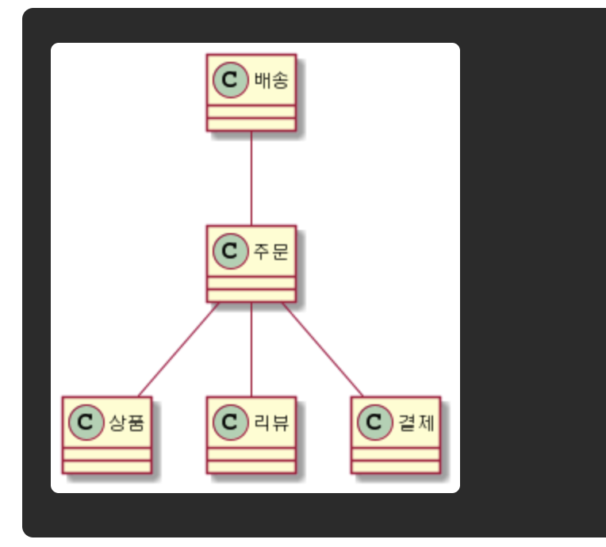
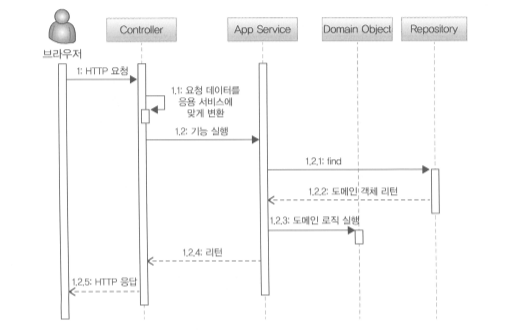

# 서론
책에 내용은 읽어보시면 될거같아서,

똑같은 내용을 리바이벌하는거보다,

공감 + 덧붙 +  감동 +  의아스러웟던 내용으로 준비해봤어요. 


# 들어가며

> `나는 그 전까지 Controller Service DAO DTO를 이용하여 웹 개발을 하고 있었는데, 
> DDD를 읽고나서 새로운 세계를 만난 기분이 들었다.`  *-by 최범균 저자*
 
공감.. 100%

# 시작. DDD.

> Domain Driven Develop

도메인 주도 개발, 도메인 위주로 개발을 하자!

-> 어려워요, 하면 할수록 어렵다는 생각을 해요.

# Chapter1. 도메인 모델 시작

## 도메인?

도메인은 소프트웨어를 통해 우리가 해결하라는 어떠한 특정 영역

예를 들어.. 

쿠팡 -> 이커머스라는 도메인

배민 -> 배달업이라는 도메인 

이런말들을 ..

*도메인 지식이 부족해서 개발이 어려워요 ㅜ.ㅜ*

*도메인이 노잼이라 개발이 하기싫엉..* 


## 하위도메인

도메인은 여러가지 하위도메인으로 이루어져 있어요.

이커머스를 예로 들면.. 간단하게는.. 



##  도메인 모델 정의

도메인 모델은 다양한 정의가 존재하는데,

도메인 모델

= 도메인을 이해하기 위해 개념적으로 표현한 것.

= 서로간의 도메인을 이해하기 위해 표현한것

클래스 다이어그램일수도, 상태 다이어그램 일 수도있고,, 제약사항은 없습니다.

개인적으로는 클래스다이어그램이 도메인 모델을 이해하기 가장 좋습니다.


그리고 그 토대를 기반으로 구현하는 것이 도메인 구현 모델입니다.

객체기반 모델 -> 개념모델

객체지향 언어로 소스코드 작성 -> 구현모델

도메인 개념모델은 처음에 픽스하는것이라, 유연하게 변경가능합니다.

## 그럼 왜 우리는 DDD를 해야하는가? 

이 책에는 왜 DDD가 좋은지 나와있지 않아요.

그 힌트를 `객체지향의 오해와 이해(토끼책)`에서 찾습니다. (추상적 조심)

> *소프트웨어 사용자가 도메인을 바라보는 멘탈모델과
> 설계자가 생각한 디자인 모델과
> 개발자가 작성하는 시스템모델이 일치하면 좋은 소프트웨어라 말할 수 있다.*

소프트웨어를 만든다는 것은 사용자(이해관계자)에게 무엇인가를 제공하기 위한 것입니다.

그럼 좋은 소프트웨어란 무엇일까? -> 사용자의 관점이 잘 반영되어있는 소프트웨어

왜? 소프트웨어의 적은 변동사항

왜? 변경을 만드는 것은 결국 사용자.. 

결론. 사용자의 관점이, 소스코드에 반영이 되어있다면, 소프트웨어는 안정적이다. 그리고 변경에 대응하기 쉽다.

결론. **DDD는 도메인에 대한 분석을 베이스로 개발 -> 이해관계자가 바라보는 관점에서 소스코드를 작성, 안정적이다.**

사용자가 바라보는 관점을, 우리의 코드로 가져온다는게 무슨말이야?

## 예제를 보아요. 도메인 모델 도출 


도메인을 이해합니다.

핵심구성요소, 규칙, 기능을 찾습니다.

객체를 찾아 정의하고, 기능을 메소드로 정의합니다.

도메인을 이해하여, 소스코드에 반영합니다.


## DDD + OOP + JPA + @

Chapter 1, 2를 보시면

보시다시피 DDD는 OOP와 잘 어울려요.

> OOP는 실세계를 비유를 통해서, 소스코드에 새로운 세계를 창조하는 것

도메인을 표현하기에 매우좋음

해결하려는 도메인을 비유를 통해서, 소스코드에 창조하자!

우리가 주문이라는 도메인객체를 `Order`라는 클래스 정의하고,

우리가 배송이라는 도메인객체를 `Ship`이라는 클래스 정의하고,

`Ship`이 `Order`에 의존하도록 코드를 짭니다.  

이해관계자의 관점, 이해 관계자가 바라보는 도메인이 

우리의 소스코드에 그대로 반영되는 것입니다.

``` java
Ship ship = new Ship(order);

public class Ship{

    private Order order;
    
    public Ship(Order order){
        validate(order) 
        this.order = order;
    }
    
    private void validate(Order order){
        if(order == null){
            throw new RuntimeException(); 
        }    
    }   
}
```

> 배송을 하기 위해선 주문정보가 필수구나
>
> 코드를 가독함으로써, 요구사항을 이해할 수 있다! 대박!


그럼 왜 JPA를 할까?

JPA는 ORM(Object Row Mapping)

관계형 데이터베이스를 객체지향적으로 사용하기 위한 프레임 워크

관계형 데이터에이스와 객체지향사이에 이질감을 극복하기 위해서 탄생.

DDD는 OOP와 궁합이 잘 맞는다.

객체지향적으로 데이터베이스를 사용하게하는 JPA

DDD - OOP - JPA !

실제로 DDD에 나오는 몇 가지 개념들이,

JPA에서 쉽게 정의해서 사용할 수 있음. 

> 예를들어, 임베디드객체 ~~ Vo

그럼 왜 Spring MVC를.. Chapter2


## Entity, DTO, VO

> 면접 단골질문 ㅎ_ㅎ

도출한 도메인 모델은 크게 Entity, Vo로 구분할 수 있다고합니다.

Entity는 식별자를 가지는 객체 (주문, 상품, 배송) 

식별자라는것은 ID (주문번호, 상품번호, 배송번호) 

= ID가 같으면 동일한 대상

ID라는 것은 다음과 같은 것을 사용

- 오토인크리먼트
- UUID
- 직접입력 등 유니크를 보장할 수 있는 값
 
책에서는 이메일, 아이디도 식별자가 된다는데

저희는 도메인 Entity를, 보통 DB Entity와 동일하게 사용하니, DB관점에서는 이렇게 쓰면 안좋아요.

ID는 비즈니스 로직에 최대한 관여하면 안됩니다.

= 오토인크리먼트를 씁시다.


VO는 값을 의미하는 객체이죠.

= 객체가 곧 값이다

= 불변해야한다. 내부값이 바뀌면 새로운 값이니까

= equals, hashcode를 내부값을 통해 비교하자.


[Dto vs Vo](https://www.podo-dev.com/blogs/180)


> Bad Example,  Dto Vo 구분없이 사용


## Entity 깊게 보기

> Entities in JPA are nothing but POJOs representing data that can be persisted to the database

우리가 배우는 도메인 Entity가  JPA의 Entity가 아닙니다.

JPA의 엔티티도 그냥 DB에 영속가능한 데이터를 의미합니다.

도메인 Enity는 도메인 규칙을 가지는 엔티티를 의미해요.

도메인 Entityh는 단순히 데이터를 담고있는게 아니라 도메인 규칙, 도메인 기능을 포함합니다.

도메인의 핵심기능을 구현합니다.


또 하나의 차이점은

도메인 Entity는 Vo를 쉽게 정의해서 사용할 수 있고,

RDB는 이게 어렵다는 내용이 나옵니다.

-> JPA로 극복가능해요.

보통 우리는 둘을 하나의 클래스? 묶음으로 사용하죵!

## 도메인에 setter 사용하지 말기

개인적으로 setter 별로 좋아하지 않습니다. (코틀린 실헝..)

이 책에서는 도메인 객체에서만 setter를 사용하지 말라고 나와있지만..

전 모든 객체에서 setter 사용을 지양합니다.

dto에서 조차 생성자를 통해 값을 초기화 시키고, 필요할때만 사용!

제 의견을 말씀드리면 setter는 캡슐화를 해칩니다.

그리고 setter는 객체를, 코드를 불안정하게해요.

setter를 제공하는 것은 변경에 열려있다는 뜻.

setter를 저희가 정의하면, 어느 개발자가 와서 setter를 사용할지 몰라요.

우리가 원하지 않는 바꿈을, 생각치도 못한 바꿈을 갑자기 협업 과정에서 setter를 통해서 이루어질수 있는 것.

아예 사용안하지는 않지만, 가능하면, 가능하면 사용 안합니다.

1단계 setter 거부

2단계 리플렉션 거부

> 인상적인 내용 공유 :)
>
> 코드를 짤때는 클래스 정의자, 클래스 사용자를 구분해서 생각해보자.
>
> 설계는 트레이드 오프의 산물이다 by 오브젝트
>
> 객체지향을 잘하는 방법 - 서로간의 API통신을 한다고 생각하면 편합니다.


## 도메인 용어

도메인 나오는 용어를 소스코드로 그대로 가져오라는 내용입니다.

우리가 개발할때도 도메인 관점에서 이해하기 쉽기 때문


개인적으로 많이 많이 중요하다고 생각합니다.

코드를 읽으면, 도메인이 읽히는 것!

예를 들면,, 이런 경험이 있어요.

기획자가 태그라는 개념을 정의를했는데.

개발단에서 Tag가 아니라.. Category 라는 언어로 정의.

상당히 꼬입니다.

개발자사이에서도 꼬이고, 기획자, 사용자 사이에서도 꼬입니다.


# Chapter2. 아키텍처 개요

## 4개의영역이 있다고 해요

- 표현  - 사용자에게 표현 
- 응용 - 도메인들을 조합하여, 사용자 유스케이스를 구현
- 도메인 - 도메인 규칙을 구현
- 인프라스트럭처 - 구현 기술


## Spring MVC

MVC 
- Model - 비즈니스 모델
- View  - 사용자 뷰단 ( REST에선 JSON VIEW)
- Controlller 인터페이스 - 비즈니스모델과 뷰의 브릿지

비즈니스 모델과 사용자게 보여지는 표현을 완벽하게 구분하자!!!!

> Bad Example
``` java
public class OrderService{
    public void cancel(HttpServletRequest request){ // request라는 것은,, 웹에한정된 오브젝트.
     ////
    }
}
```

우리가 집중에 해야할것은 Model(비즈니스 모델, 서비스 레이어)

서비스 레이어에서 할일 =  도메인 객체들을 이용하여, 도메인 규칙을 다루자!

그 밖에,, 스프링의 각종 기술들의 도움을.. (인터셉터,, AOP,,, 필터,, 시큐리티,, 등등..)


## 고수준, 저수준

고수준, 저수준의 개념이 잘 정의가 안되어있습니다.

인풋, 아웃풋이랑 가까우면 저수준, 멀면 고수준이에요

컨트롤러는 서비스보다 인풋에가깝죠 -> 컨트롤러는 상대적으로 저수준이에요

레포지터리는 서비스보다 인풋/아웃풋에 가깝죠 -> 레포지터리는 상대적으로 저수준이에요

서비스는 도메인객체보다 인풋/아웃풋에 가깝죠 -> 서비스는 상대적으로 저수준이에요

도메인은 핵심 비즈니스모델을 구현하죠, 인풋/아웃풋이랑은 거리가 가장 멀어요 -> 도메인은 고수준이에요

저수준은 고수준에 의존해야한다.

왜? 인풋/아웃풋 구현, 구현은 변경

예를들면 서비스가 MyBatisRepository라는 구현에 의존하고있습니다.

서비스에는 MyBatis 문법이 덕지덕지.. 근데 어느순간 MyBatis 별로야, JPA쓰자!

JpaRepository로 의존을 변경합니다. 그럼 서비스에서의 코드수정이..

이럴때 사용하는 것이 의존성역전, 저수준에서 고수준으로 의존하게하자!!


Repositoy를 Service와 비슷한 수준으로 끌어올립니다! 의존성역전.

MyBatisRepository를 JpaRepository 바꾸더라도, 소스코드에 변경은 없습니다

DIP를 굳이 사용안하더라도, 외부와의 연동에서는 한번 마는것을 추천드립니다.

여기서 spring에 또 감동받아야되는게 하나있는데..

spring-boot-starter-data

spring-boot-starter-data-redis

spring-boot-starter-data-jpa

> 흔한 잘못된 코드..
``` java
@Entity
public void Product{

    @Id
    private Long id;
    
    private String productName;
    
    public ProductDto toDto(){
        return new ProductDto(id, productName);
    }
}
```
> 그래서 자주 하는 말.. 도메인은 순수해야합니다.

## DIP (의존성 역전)

의존성 역전. 

주의 할것, 도메인 관점에서 추상화 합시다.

의존성역전을 통해 이룰수 있는 것

- 확장 가능함
- 플러그인 아키텍쳐

> 결국 우리가 원하는 의존성.


## 인프라스트럭처 

DIP에서 언급한것처럼 인프라스트럭처를 직접사용하는것보다 DIP를 사용하여

유연하고, 테스트하기 편하게 하는 것이 중요.

하지만 여기서도 트레이드오프 발생.

무조건적인 인프라스트럭처에 대한 의존X는 오히려 코드를 더복잡하게함.

@Transactinal은 응용계층이 스프링 프레임워크에 의존하게 만듭니다.

@Entity는 엔티티 객체가 jpa에 의존하게 만듭니다.

하지만 이를 사용하지 않는다면, 코드는 오히려 더더더 복잡해집니다.

> 설계는 트레이드 오프의 산물이다.

## 도메인 영역의 주요 구성요소

- 엔티티 - 식별자를 가진 객체
- 벨류(VO) - 값 객체 
- 애그리거트 - 챕터3에 넘길게요 :)
- 레포지터리 - 도메인 영속을 위한 인터페이스
- 도메인 서비스 - 도메인의 규칙을 서비스로 클래스로 분리한거에요. (요거는 잘모르겠네요..솔직히..)


## 결론, 예를 들어 이런 코드?



> 요구사항1) 최소한 하나의 상품을 주문 할 수 있다.
> 요구사항2) 주문은 취소 할 수 있다.

``` java
package io.kakaoenterprise.client.kwauth.vo;

import lombok.RequiredArgsConstructor;
import org.springframework.transaction.annotation.Transactional;

import javax.persistence.Entity;
import javax.persistence.OneToMany;
import java.util.List;

   
@Entity
public class Order{

    private OrderStatus status;
    
    @OneToMany // OneToMany 유의사항
    private List<Product> products;

    public Order(List<Product> products) {

        if(products.empty()){
            throw new RuntimException();
        }

        this.products = products;
    }
    
    public void cancel(){
        this.status = OrderStatus.CANCLE;
    }
}

@Entity
public class Product{

}

@RestController
public class OrderController{

    private final OrderService orderService;

    @PostMapping("/주문하자")
    public Long orderProducts(List<Long> productIds){
            return orderSevice.order(productIds);
    }
    
    @PostMapping("/주문취소")
    public Long cancelOrder(Long orderId){
            return orderSevice.cancel(orderId);
    }
}

@RequiredArgsConstructor
public class OrderService{

    private final OrderRepository orderRepository;
    private final ProductRepository productRepository;

    @Transactional
    public Long order(List<Long> productIds){
        List<Product> products = productRepository.findInProductIds(productIds);
        Order order = new Order(products);
        Order savedOrder = orderRepository.save(order);
        
        return savedOrder.getId();
    }
    
    @Transactional
    public void cancel(Long orderId){
        Order order = orderRepository.findById(orderId);
        order.cancel();      
    }

}

public interface OrderRepository{
    public Order save(Order order); 
}

public interface ProductRepository{
    public List<Product> findInProductIds(List<Long> productIds);
}
```
> 코드만 읽어도, 아! 요구사항이 이랬구나! 대박!


## 패키지 구성

패키지를 어떻게 구성할 것인가?

-> 방식이 정해져 있지는 않습니다.

하지만 보통..

프로젝트가 작다면, 계층 위주로가 좋습니다. <br/>


프로젝트가 크다면, 도메인 위주가 좋습니다. <br/>


추천 post. [https://cheese10yun.github.io/spring-guide-directory/](https://cheese10yun.github.io/spring-guide-directory/)


> Bad Example
> 프로젝트는 크나 계층 구조


> Good Example
> 프로젝트가 큰 도메인 위주


